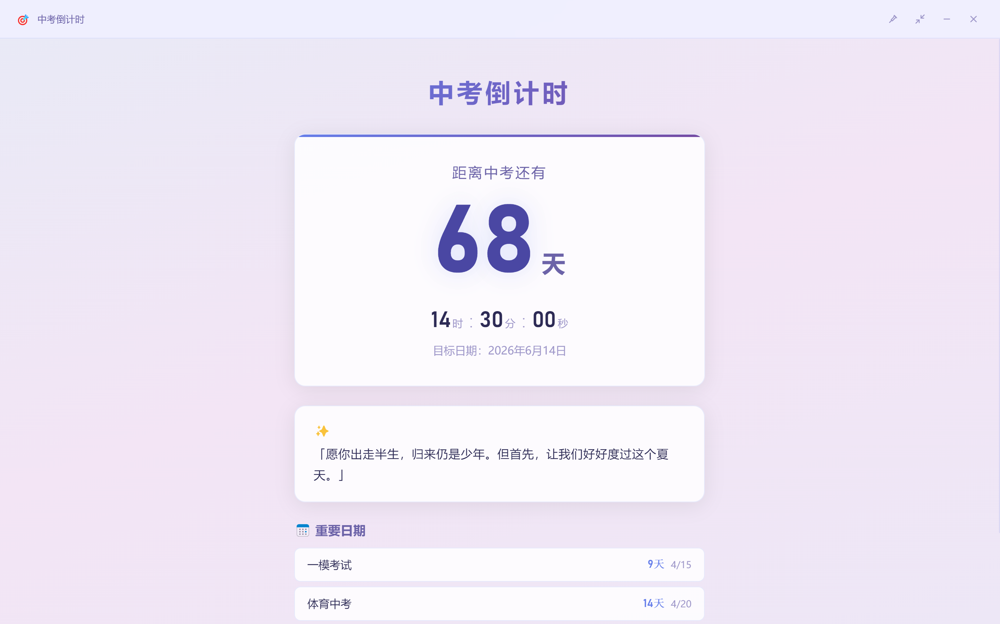
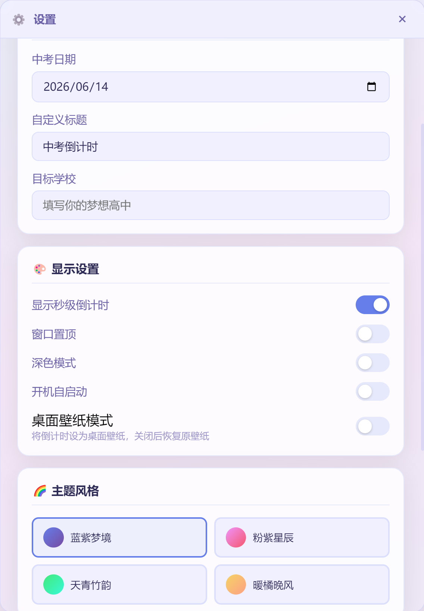

# 中考倒计时

一款桌面倒计时应用，陪你冲刺梦想高中。

## 功能特性

- 中考倒计时显示（天/时/分/秒）
- 桌面壁纸模式 —— 将倒计时设为桌面壁纸
- 多主题切换（蓝紫梦境 / 粉紫星辰 / 天青竹韵 / 暖橘晚风）
- 暗色模式
- 紧凑模式 / 全屏模式
- 重要日期倒计时（一模、体育中考、二模等）
- 每日励志名言
- 开机自启动
- 窗口置顶
- 系统托盘

## 演示







## 技术栈

- Electron 33
- 原生 HTML/CSS/JavaScript
- electron-builder 打包

## 构建

```bash
npm install
npm run build          # 同时构建安装包和便携版
npm run build:nsis     # 仅构建安装包
npm run build:portable # 仅构建便携版
```

## 版本记录

### v1.3.0

- **开机自动更新壁纸**：修复壁纸模式下开机自启后壁纸不会自动刷新的问题。现在程序启动时会可靠地等待壁纸渲染窗口加载完成后再进行截图和设置，确保每天开机后倒计时天数、名言、重要日期都能自动更新
- **壁纸更新提示弹窗**：开机启动更新壁纸时，会弹出一个简洁的提示窗口显示"正在更新桌面壁纸..."，更新完成后自动切换为"壁纸已更新"并在 1.5 秒后自动关闭
- **每日名言自动刷新**：新增每日名言刷新机制，每天首次启动时自动清除昨天的名言，显示当天的新名言，无需手动操作

### v1.2.0

- **壁纸布局优化**：缩小标题（52px → 40px）、天数（180px → 130px）等字体大小，减小间距和内边距，确保在 1366x768、1920x1080 等常见分辨率下壁纸内容不被遮挡
- **移除壁纸时分显示**：壁纸为静态图片，时分秒会固定不变导致误导，改为仅显示天数倒计时
- **壁纸更新间隔调整**：从每 60 秒刷新改为每 30 分钟刷新，降低资源占用
- **壁纸模式自动开启开机自启**：开启壁纸模式时自动设置开机自启动，确保每天开机后壁纸能自动刷新为当天的倒计时天数
- **壁纸名言同步修复**：主窗口点击"换一句"后，壁纸上的名言同步更新（通过 config 传递当前名言）

### v1.1.0

- 初始版本
- 基础倒计时功能
- 桌面壁纸模式
- 多主题 / 暗色模式
- 重要日期管理
- 每日名言
- 系统托盘集成
